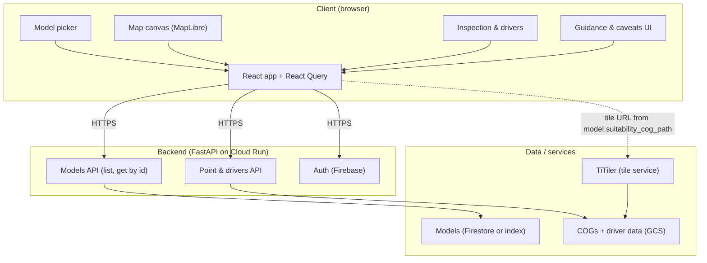

# Solution architecture

This document describes the high-level solution architecture for the Bat Habitat Suitability Conservation Tool, linking product goals and MVP scope to technical design.

## 1. Design context (from product docs)

### How the docs hang together

- **Problem statement** defines the need: turn fragmented, uneven evidence into practical action (survey planning, site interpretation, conservation prioritisation). Non-goals: no replacement of field survey, no automation of decisions.
- **Outcomes and product goal** state the outcome (better, faster, more consistent decisions) and the product goal (explore suitability, understand drivers, apply in workflows).
- **Users and use cases** identify primary users (conservation practitioners, consultants) and three priority use cases: survey targeting, site-in-landscape interpretation, conservation prioritisation.
- **Product principles** drive design: decision support not automation; interpretability before sophistication; regional-to-local workflow first; ecological trust; visible limitations; real tasks; narrow first version; explainable decisions.
- **MVP scope** defines the smallest useful product: four journeys (explore suitability, investigate local area, understand drivers, use responsibly) with must-haves and clear out-of-scope.

### What the MVP demands of the system

| MVP need | Implication for architecture |
|----------|------------------------------|
| Species/model selection | Catalog of models with stable id; GET /models (list), GET /models/{id}; UI to list and select by model (or species + activity). |
| Interactive map exploration | Web map (MapLibre); raster tiles for suitability; regional-to-local zoom and pan. |
| Point or site inspection | Click → get value at point; optionally get “what’s driving suitability here” (variables, direction, plain-language summary). |
| Simple explanation of local drivers | Backend capability to return main variables and contribution (increase/decrease) per location; frontend to show in plain language. |
| Clear interpretation guidance and caveats | Persistent UX for “what this map means” and limitations; content and placement designed up front. |
| Basic metadata (model name, version) | Metadata store or config per model; exposed via API and shown in UI. |

Out of scope for MVP: end-user model training, full GIS editing, complex multi-species prioritisation, broad biodiversity platform.

---

## 2. High-level architecture

- **Client**: Single-page app (React + TypeScript). Species/model selection, map, point inspection and driver explanation, and interpretation/caveats are first-class UI areas.
- **Backend**: FastAPI. Exposes GET /models, GET /models/{id}, GET /models/{id}/point. COGs produced elsewhere, ingested via admin upload; DB stores artifact locations. Auth via Firebase where required.
- **Raster serving**: COGs in GCS; TiTiler as its own Cloud Run service (own container). Frontend builds tile URL from model's suitability COG path.
- **Driver explanation**: Implemented either by precomputed layers (e.g. variable importance or contribution rasters) or by a small service that, given (x, y, model_id), returns main variables and direction. MVP favours “simple explanation” over full model internals.

---

## 3. Subsystems and responsibilities

### 3.1 Models (catalog)

- **Purpose**: Support “choose species and model type” (MVP journey 1).
- **Responsibilities**: List available species and models; expose display names, IDs, and links to raster and metadata; expose basic metadata (model name, version) for UI.
- **Data**: Firestore (recommended for cost control; see [Infrastructure and deployment](infrastructure-and-deployment.md)) or config (e.g. JSON index); references to COG paths and optional driver datasets.
- **API**: `GET /models` (list), `GET /models/{id}` (single). See [Data models](data-models.md).

### 3.2 Raster tile pipeline

- **Purpose**: “View the habitat suitability map” and “move around the region” at regional and local scales.
- **Responsibilities**: Serve web-ready tiles from COGs; support regional-to-local zoom; optional caching (CDN or response headers).
- **Components**: COGs in GCS; **TiTiler as a separate Cloud Run service** (its own container). Frontend builds TiTiler tile URL from the model's suitability COG path.
- **MVP**: Single suitability layer per model; no multi-species aggregation in tiles.

### 3.3 Point and site inspection

- **Purpose**: “Click or inspect a location” and “see a simple explanation of the main variables” (MVP journeys 2 and 3).
- **Responsibilities**: Return suitability value at a point; return “drivers” (main variables, increase/decrease) and, if available, a short plain-language summary.
- **API**: `GET /models/{id}/point?lng=&lat=`. Response: PointInspection (value, unit?, drivers[]). See [Data models](data-models.md).
- **Implementation**: Raster read at point plus driver raster or lookup, or small service keyed by (x, y, model_id). MVP prefers simple lookup or precomputed data.

### 3.4 Interpretation guidance and caveats

- **Purpose**: “Use outputs responsibly” and “understand what the map means” (MVP journey 4); product principle “make limitations visible”.
- **Responsibilities**: Provide in-app content and placement for: what suitability means, that it is relative not proof of presence/absence, that the tool supports (not replaces) judgement. Not buried in a single doc page.
- **Implementation**: Copy and structure in frontend (or CMS); visible in panel/modal/onboarding and/or next to map/legend. No new backend service; treated as a core UX and content concern in architecture.

### 3.5 Authentication (optional for MVP)

- **Purpose**: Control access if required; future sharing and saved state.
- **Responsibilities**: Firebase Auth; backend validates token where needed. MVP can be unauthenticated if product decision allows; architecture still assumes auth exists for production.

### 3.6 Admin / catalog management

- **Purpose**: Support the admin user story: add new species and upload models and associated data (COGs produced elsewhere, added via admin). In scope for MVP.
- **Responsibilities**: Accept new or updated models via upload or path; assign stable id on create; write artifacts to a **sensible folder structure** in storage (e.g. one folder per model, consistent naming); store **artifact locations in the DB** (artifact_root, suitability_cog_path, optional driver_config). Admin actions restricted (auth + admin role).
- **API**: `POST /models` (create; body: species, activity, COG upload or path, optional metadata and driver config; backend assigns id, writes to storage, saves paths in Firestore), `PUT /models/{id}` (update). List: same `GET /models`.
- **UI**: Admin route (e.g. `/admin`): list models, form to add or edit model (species, activity, COG upload or path, optional model name/version, driver config); auth-gated.

---

## 4. Data flow (MVP-focused)

1. **App load**: Frontend calls `GET /models` once; list of models (id, species, activity, suitability_cog_path, ...). User sees model (or species/activity) selector and map. No second "get URL" request.
2. **Model selected**: Frontend has full model from list; sets raster tile source from model.suitability_cog_path (build TiTiler URL). Map requests tiles on viewport/zoom.
3. **User pans/zooms**: MapLibre requests tiles; TiTiler serves from COGs. Regional-to-local use case supported by zoom level and extent.
4. **User clicks map**: Frontend calls `GET /models/{id}/point?lng=&lat=`. Response: PointInspection (value, drivers). Frontend shows value and “what’s driving suitability here” in plain language.
5. **Interpretation**: Caveats and guidance are shown in UI (panel/modal/legend) from static or CMS content; no extra API for MVP.

---

## 5. MVP vs later scope (architecture view)

| Capability | In MVP | Later (post-MVP) |
|------------|--------|-------------------|
| Species/model selection + map | Yes | — |
| Point value + simple driver explanation | Yes | Richer explanation, uncertainty |
| Interpretation guidance and caveats in UI | Yes | — |
| Basic metadata (name, version) | Yes | Full model card, methods |
| Area query (polygon average) | Optional (should-have) | Yes |
| Side-by-side comparison | Optional (should-have) | Yes |
| Export map / summary | Optional (should-have) | Yes |
| Vector overlays (e.g. protected areas) | Optional | Yes |
| Multi-species / richness layers | No | Yes |
| Saved sessions, sharing links | No | Yes |
| Admin: add species/models via UI and API | Yes | — |
| Full GIS-style editing | No | Out of scope |

---

## 6. Key technical decisions

| Decision | Choice | Rationale |
|----------|--------|-----------|
| Raster delivery | COGs + TiTiler | Efficient, standard; matches existing spec. |
| Map library | MapLibre GL | No Mapbox fees; sufficient for tiles + vector. |
| Driver explanation | Per-point API + simple data (rasters or lookup) | Keeps MVP interpretable without exposing full model internals. |
| Metadata source | Config or lightweight DB | MVP can use JSON/index file; migrate to DB if catalog grows. |
| Interpretation content | In-app copy / CMS, not only docs | Aligns with “make limitations visible” and “interpretability first”. |
| Auth | Firebase Auth, optional for MVP | Matches application-spec; can gate by environment. |
| **Cost** | Low, predictable GCP spend; budget alerts; scale-to-zero; recommended stack (Firebase Hosting, Cloud Run, Firestore, GCS) | Solo developer must not be personally liable for surprise costs. See [Users and use cases](users-and-use-cases.md) (solo app developer) and [Infrastructure and deployment](infrastructure-and-deployment.md). |

---

## 7. Design for extension

The following keeps the design easy to extend as scope grows (comparison, area query, vector overlays, multi-species/richness, saved sessions, richer metadata).

**API and identity**

- Keep `/models` and `/models/{id}` as the only first-class raster resource. Add query params (e.g. `GET /models?species=`) later for filtering; add a separate endpoint for combined/richness (e.g. `GET /models/combined?ids=...`) if needed, rather than overloading the single-model contract.
- Scope point and area by model: `GET /models/{id}/point`, `GET /models/{id}/area` (polygon). Same pattern for inspection and future area stats.

**Layers**

- Treat raster layers (models) and vector/overlay layers as separate concepts. Add a distinct surface for overlays (e.g. `GET /layers` or `GET /vectors`) and a VectorLayer type so the map can mix one-or-more models with N vector layers without overloading the Model type.

**Frontend**

- Single source of truth for selection: store `modelId` (and later `comparisonModelId` or `selectedModelIds[]`). All map, point, and metadata logic reads from that so comparison and multiple layers are a small step.
- Put map state in the URL where possible (`?model=id`, and later `lat`, `lng`, `zoom`, `compare=id`) so sharing and saved sessions need minimal new work.
- Layer list as a component that accepts a list of layer descriptors (id, label, type, opacity, visibility) so it can later show one raster plus N vector layers without reworking the map.

**Backend and storage**

- Driver explanation as a per-model capability: optional `driver_path` or driver config on Model so `GET /models/{id}/point` can stay one endpoint while the backend chooses how to get drivers per model (raster, lookup, or none).
- Prefer Firestore (or DB) for the catalog so new fields and filters (e.g. taxon, group) don’t require a new API shape; keep document shape aligned with Model.

**Catalog evolution**

- Add optional fields to Model (e.g. driver config, taxon_id, metadata blob) as needed; frontend and admin can ignore unknown keys. Avoid encoding expansion in new top-level resources until necessary (e.g. “projects” or “groups” reference model ids).

---

## 8. Document references

- Product and MVP: [Problem statement](problem-statement.md), [Outcomes and product goal](outcomes-and-product-goal.md), [Users and use cases](users-and-use-cases.md), [Product principles](product-principles.md), [MVP scope](mvp-scope.md).
- Data: [Data models](data-models.md) (target: Model, catalog, PointInspection, DriverVariable).
- Infrastructure and deployment: [Infrastructure and deployment](infrastructure-and-deployment.md) (target architecture, recommended stack, guardrails).
- Implementation detail: [Application spec](../application-spec.md) (tech stack, endpoints, phases).
