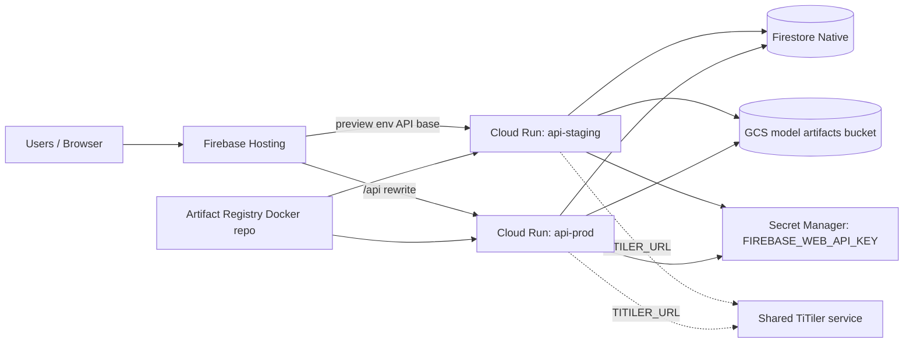
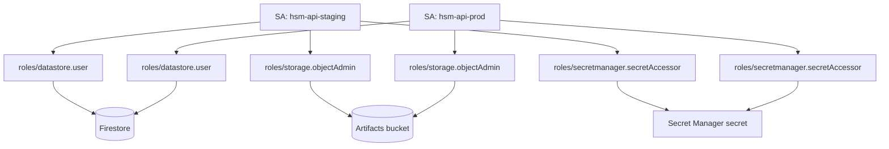
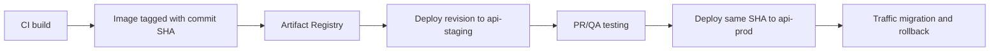

# Infrastructure architecture (Terraform baseline)

This document explains the resources currently defined in `infra/terraform` and how they connect.

Scope: this is the **minimal MVP baseline** for `hsm-app` (project id `hsm-app-493209`, region `us-central1`) and is intentionally review-first.

## 1) High-level topology

## 2) Terraform resources and intent

### Platform services

- `google_project_service.required`
  - Enables required APIs:
    - Artifact Registry
    - Cloud Build
    - Firestore
    - Cloud Run
    - Secret Manager
    - Cloud Storage
  - Most other resources depend on this so provisioning order is stable.

### Build and image storage

- `google_artifact_registry_repository.backend`
  - Docker repo for backend images.
  - CI/CD should push immutable tags (prefer Git SHA).

### Data stores

- `google_storage_bucket.model_artifacts` (optional via `create_gcs_bucket`)
  - Stores uploaded COG/artifact files used by API.
  - Uniform bucket-level access enabled.
  - Versioning enabled.
- `google_firestore_database.default` (optional via `create_firestore_database`)
  - Creates `(default)` Firestore Native DB if not already present.

### Runtime identities

- `google_service_account.api_staging`
- `google_service_account.api_prod`
  - Separate service accounts for environment isolation.

### IAM bindings

- `google_project_iam_member.api_*_firestore_user`
  - Grants `roles/datastore.user` to API runtime SAs.
- `google_storage_bucket_iam_member.api_*_storage_admin` (if bucket managed here)
  - Grants `roles/storage.objectAdmin` on artifacts bucket.
- `google_secret_manager_secret_iam_member.api_*_secret_accessor`
  - Grants `roles/secretmanager.secretAccessor` for Firebase Web API key secret.
- `google_cloud_run_v2_service_iam_member.api_*_invoker` (optional)
  - If `allow_unauthenticated_api = true`, grants `roles/run.invoker` to `allUsers`.

### Cloud Run services

- `google_cloud_run_v2_service.api_staging`
- `google_cloud_run_v2_service.api_prod`
  - Two-service pattern to keep staging/prod config independent.
  - Both include:
    - scaling controls (`min_instance_count`, `max_instance_count`)
    - CPU/memory limits
    - request timeout
    - container port
    - env vars wired for backend settings:
      - `GOOGLE_CLOUD_PROJECT`
      - `STORAGE_BACKEND=gcs`
      - `GCS_BUCKET`
      - `GCS_OBJECT_PREFIX`
      - `CORS_ORIGINS` (env-specific)
      - `OPENAPI_ENABLED=false`
      - `TITILER_URL` (shared TiTiler endpoint)
      - `FIREBASE_WEB_API_KEY` from Secret Manager
  - Traffic currently points 100% to latest revision (simple baseline).

## 3) Identity and permissions flow

## 4) Deployment/promotion model this supports

This matches the project runbook direction:

- build once
- validate on staging
- promote same artifact to production

## 5) Cost guardrails in this baseline

- Region pinned to `us-central1` for better free-tier alignment.
- Cloud Run limits default to `min=0` and `max=1` per API service.
- GCS bucket versioning is disabled by default to avoid hidden storage growth.
- Optional Cloud Billing budget alerts can be enabled in Terraform:
  - monthly budget target (default `$5`)
  - alert thresholds at `50%`, `90%`, `100%`

## 6) Defaults chosen for cost control

- Region default set to `us-central1`.
- `min_instance_count = 0`.
- low `max_instance_count` default.
- no per-PR Cloud Run service creation.

## 7) Current boundaries (intentional)

Not managed yet in this Terraform baseline:

- Firebase Hosting config and channel rewrites
- TiTiler provisioning (treated as shared stable external endpoint)
- Billing budgets/alerts
- CI/CD workflow resources (GitHub Actions remains separate)

These can be added incrementally after review.
